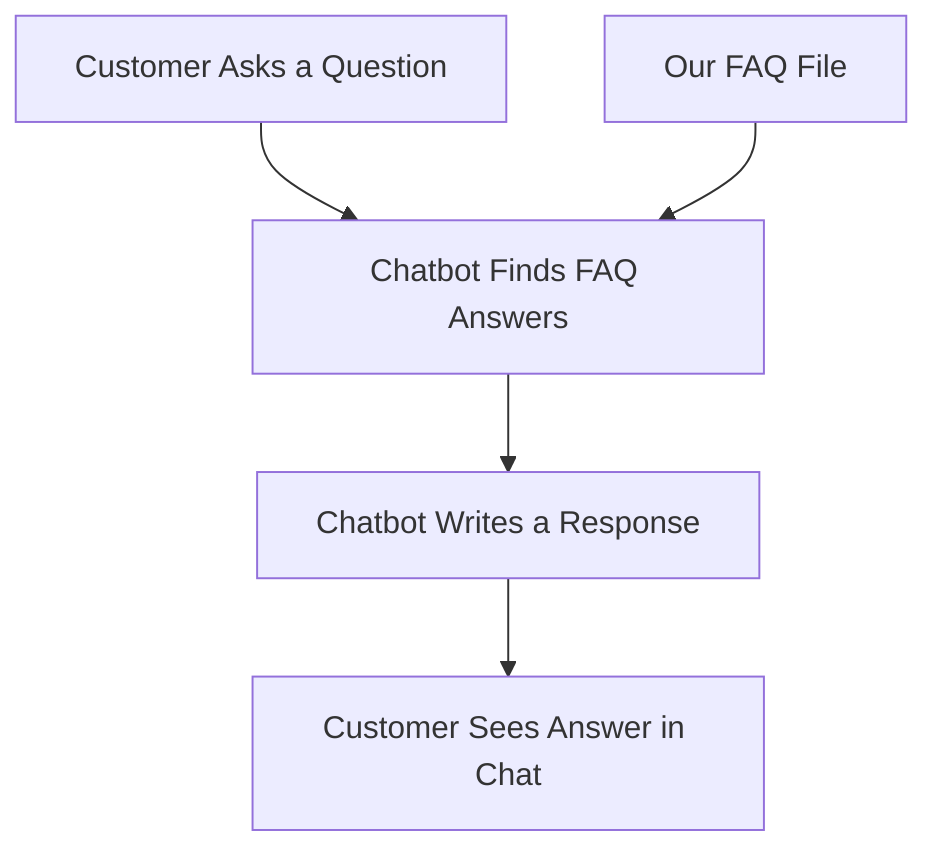

## What Is This Project?

The **UK Mega Shop Customer Support Chatbot** is an AI-powered tool designed to answer customer questions about our website instantly. It uses smart technology to pull answers from our FAQ list and respond naturally, reducing the workload on our support team and improving customer satisfaction.

- **Why It Matters**: Saves time, cuts support costs, and keeps customers happy with fast, accurate answers.
- **How It Works**: Combines a searchable FAQ database (Pinecone), text understanding (OpenAI), and human-like responses (Google Gemini), all wrapped in an easy-to-use chat interface (Streamlit).

## How It Works (Simple Overview)



1. A customer types a question (e.g., "What payment options do you offer?").
2. The chatbot searches our FAQ database for the best matches.
3. It writes a clear, friendly response using AI.
4. The answer appears in the chat instantly.

## Quick Start Guide

### What You Need

- A computer with Python installed (version 3.9 or higher).
- API keys from Pinecone, OpenAI, and Google (our tech team can provide these).
- The project files from this repository.

### Steps to Set It Up

1. **Get the Files**:
   
   - Download or clone this project from our GitHub repo: `asifthedev-chatbot-rag`.

2. **Set Up API Keys**:
   
   - Create a file called `.env` in the project folder with these lines:
     
     ```
     PINECONE_API_KEY=<your-pinecone-key>
     OPENAI_API_KEY=<your-openai-key>
     GOOGLE_API_KEY=<your-google-key>
     ```
   - Replace `<your-...-key>` with the actual keys (ask IT if you don’t have them).

3. **Install the Tools**:
   
   - Open a terminal in the project folder and run:
     
     ```bash
     python -m venv venv
     source venv/bin/activate  # On Windows: venv\Scripts\activate
     pip install -r requirements.txt
     ```

4. **Load Our FAQs**:
   
   - Make sure `dataset/faq.csv` has our latest FAQ list.
   - Run this command to load it into the system:
     
     ```bash
     python data_ingestion.py
     ```

5. **Start the Chatbot**:
   
   - Run this command:
     
     ```bash
     streamlit run app.py
     ```
   - Open a web browser to `http://localhost:8501` to see the chatbot in action.

6. **Test It**:
   
   - Type a question like “What’s the delivery time?” and watch it respond!

## What’s Inside the Project?

- **`app.py`**: The chatbot’s main program—runs the chat interface.
- **`data_ingestion.py`**: Loads our FAQ data into the system.
- **`dataset/faq.csv`**: Our FAQ list (questions and answers in a simple table).
- **`requirements.txt`**: List of tools the project needs to run.

## Example Usage

- **Customer Question**: "Can I pay with Paytm?"
- **Chatbot Response**: "During checkout, you can pay using Visa, MasterCard, American Express credit/debit cards, PayPal, and Apple Pay. Paytm is not available."

## How to Update FAQs

1. Edit `dataset/faq.csv` with new questions and answers (it’s just a simple spreadsheet).
2. Run `python data_ingestion.py` again to update the chatbot’s knowledge.

## Requirements

Save this as `requirements.txt` in the project folder:

```
# Basic tools
python-dotenv==1.0.1  # Loads API keys securely
streamlit==1.38.0     # Runs the chat interface
pandas==2.2.2         # Handles the FAQ file

# AI and search tools
pinecone-client==5.0.1      # Searches our FAQ database
openai==1.46.1              # Understands text
google-generativeai==0.8.2  # Writes responses

# Extra helpers
typing-extensions==4.12.2  # Keeps code running smoothly
```

Install with:

```bash
pip install -r requirements.txt
```
